# Create communication between docker containers using Openvswitch


## Introduction:
In this tutorial, we will delve into VxLAN technology, Docker containers, openvswitch and the process of creating and establishing communication between them.

We will have two host machine(ubuntu) and four container in the two host machine. We will ping from one container in first host machine to another container in second host machine via openvswitch bridge.

For this tutorial basic please first go through this vxLAN tutorial. Because this tutorial is an extension of that tutorial.

## What is VxLAN?

VXLAN (Virtual Extensible LAN) is a network virtualization technology that enables the creation of virtualized Layer 2 networks over existing Layer 3 infrastructure. It allows for the encapsulation of Layer 2 Ethernet frames within Layer 3 UDP (User Datagram Protocol) packets, facilitating the extension of virtual networks across different physical networks or data centers. VXLAN helps overcome scalability limitations in traditional Layer 2 networks by providing a larger address space and allowing for efficient network overlays, making it well-suited for virtualized and cloud environments.
## What is VNI?

VNI stands for Virtual Network Identifier. It is a key component of VXLAN technology. Each VXLAN network is assigned a unique VNI, which serves as an identifier for the virtual network. The VNI acts as a segmentation mechanism, allowing multiple virtual networks to coexist over a shared physical network infrastructure. When encapsulating Layer 2 Ethernet frames into VXLAN packets, the VNI is included in the packet header to distinguish between different virtual networks. This enables the isolation and segmentation of traffic across VXLAN networks, providing the ability to create and manage multiple logical networks on top of a common physical infrastructure.
## What is VTEP?

VTEP stands for VXLAN Tunnel Endpoint. It is a network device or component that serves as the entry and exit point for VXLAN traffic. The VTEP is responsible for encapsulating and decapsulating Layer 2 Ethernet frames into VXLAN packets as they traverse between the virtual and physical networks.
## What is underlay network?
The underlay network refers to the physical network infrastructure that provides connectivity between network devices, such as switches, routers, and servers. It serves as the foundation on which virtual networks and overlays, like VXLAN, are built.

The underlay network typically consists of physical cables, switches, routers, and other networking devices that establish connectivity between different endpoints. It handles the transport of data packets, routing of traffic, and provides the necessary bandwidth and reliability for network communication.

In the context of VXLAN, the underlay network carries the encapsulated VXLAN packets between VTEPs (VXLAN Tunnel Endpoints) over IP (Internet Protocol) or other transport protocols. The underlay network does not have direct knowledge of the virtual networks or overlays running on top of it.

The underlay network’s primary role is to provide efficient and reliable transport of traffic between network devices, while the virtual networks and overlays, such as VXLAN, operate at a higher level to enable network virtualization, segmentation, and isolation.

In summary, the underlay network forms the physical infrastructure that supports the operation of virtual networks and overlays, providing the necessary connectivity and transport for network traffic.
## What is overlay network?

An overlay network is a computer network that is built on top of an existing network infrastructure, such as the internet or a private network. It provides additional functionality or services by encapsulating and tunneling network traffic over the underlying network.

In an overlay network, nodes (computers or network devices) establish virtual connections with each other, forming a logical network on top of the physical network. These virtual connections are typically created using software-defined networking (SDN) techniques or protocols.
## What is Container?

A container is a lightweight, standalone, and executable software package that contains everything needed to run an application, including the code, runtime, system tools, libraries, and configurations. It is based on the concept of containerization, which allows applications to be isolated and run in a consistent environment across different computing environments.

Containers provide a level of abstraction, similar to virtual machines, but with lower overhead and greater efficiency. Unlike virtual machines, which run a complete operating system on top of a hypervisor, containers share the host machine’s operating system kernel. This shared kernel makes containers lightweight, quick to start, and allows for greater resource utilization.
## What is docker?

Docker is an open-source platform that allows you to automate the deployment, scaling, and management of applications using containerization. It provides a way to package software and its dependencies into standardized units called containers.
## What is Openvswitch?

OpenvSwitch (Open vSwitch or OVS) is an open-source, multi-layer software switch that is designed to enable network automation, virtualization, and SDN (Software-Defined Networking). It allows network administrators to create and manage virtualized network environments in a flexible and scalable manner.
## Overview of the full diagram below:
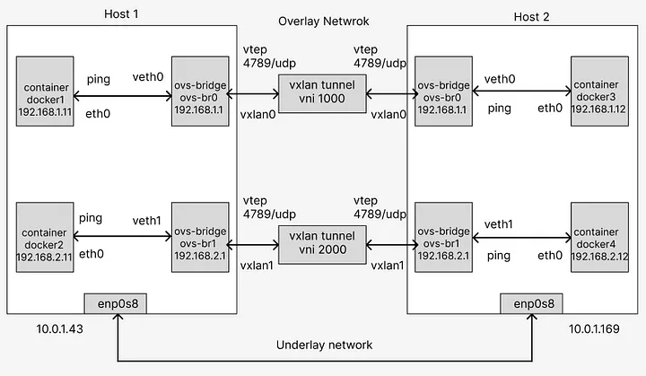


## Prerequisites:

- Basic familiarity with Linux and networking concepts.
- Vagrant, Git and VirtualBox installed on your machine.
## Step 1: Setting Up the Environment:

First you need to install oracle virtual box, git and vagrant. Now create a new folder name vagrant-vms(you can give any name as your wish). Now go to vagrant-vms folder and create two folder Host 1 and Host 2(you can give any name as your wish).


I make this two folder because i will create two ubuntu virtual machine in to this two folder and also install docker container into this vm(virtual machine) and also install bridge using openvswitch and communicate between the container via VxLAN Tunnel using openvswitch bridge. Yes this is the ultimate goal we will achieve today in this tutorial. So, read carefully, i will describe step by step process.

We will need two git bash terminal. Now go to Host 1 folder and open git bash terminal here.Now run this command in the git bash

```ruby
vagrant init ubuntu/bionic64
```

It will create the ubuntu 18 virtual os in Host 1 folder, but it will take some time.

Now go to Host 2 folder and open git bash terminal here.Now run this command again.

```ruby
vagrant init ubuntu/bionic64
```
It will create the ubuntu 18 virtual os in Host 2 folder.

Now open the oracle virtual box, you will see this two os.

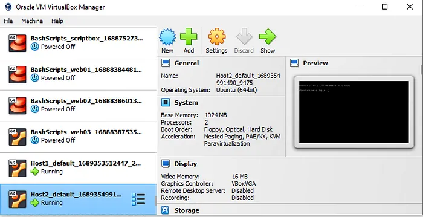

Ignore the other vm(BashScripts), that was my for other projects. So, succcessfully we have created the virtual machines.

Now, for this project we will give static ip address to this two virtual machine Host 1 and Host 2 manually and also we will make sure that two virtual machine should be in the same network. We will give 10.0.1.43 ip address to Host 1 and 10.0.1.169 ip address to Host 2, so that they are in the same network. For this, please type the command in the two git bash terminal two power off the vm.
```ruby
vagrant halt
```
Now go to Host 1 folder and you will see the vagrant file there. Open it with Notepad++(any text editor you wish). This script is written in ruby, don’t worry about this script. Go to line number 35. if you don’t see ip address after private network, please add this ip adress.


now remove the ‘#’ sign. It will uncomment this line and will assign ip adress to this vm. Now save this file. Same, you have to go Host 2 folder and uncomment the line number 35 and add ip address 10.0.1.169 and save it.

1) Now, again open one git bash for Host 1(you have to go to Host 1 folder and open git bash here) and another git bash for Host 2.
Type this command in the two git bash.

```ruby
vagrant up
```
So, far we have two host running with the ip address 10.0.1.43 and 10.0.1.169, check in oracle virtual box. Now check this fighure below, here enp0s8 is the interface of the virtual machine. We have attached our ip addresses to this interface. You should remember this interface enp0s8, because we will need this in later.

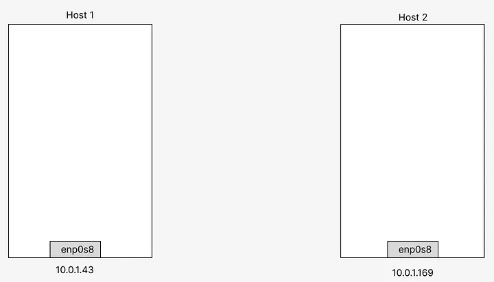

2. Once the VM is up and running, access the command prompt within the VM by running:
```ruby
vagrant ssh
```
3. Now swith to root user. Type inboth git bash.
```ruby
sudo -i
```
Now, just for testing prupose type this command from Host 1 gitbash.
```ruby
ping 10.0.1.169 -c 5
```
You will get output like this.

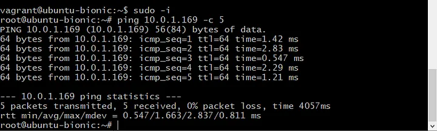


See, you have successfully ping the Host 2(10.0.1.169). we received 5 packets result as we give in the command. You can also check from host 2 gitbash(ping 10.0.1.43 -c 5).

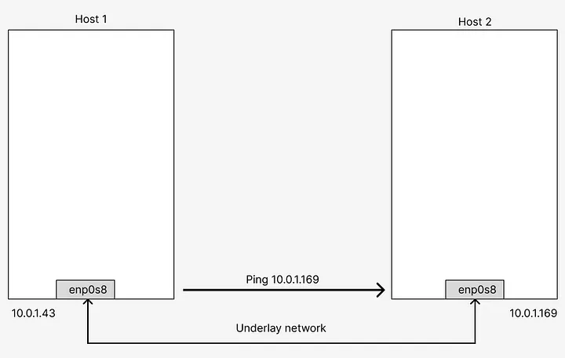


So, Host 1 and Host 2 can communicate with each other, but our goal is different. We will create docker container inside two host and will ping form each other vai openvswitch bridge to connect them.

## Step 2: Install essential packages:

For Host 1:
```ruby
# update the repository
sudo apt update

# Install essential tools
sudo apt -y install net-tools docker.io openvswitch-switch
```

For Host 2:


```ruby
# update the repository
sudo apt update

# Install essential tools
sudo apt -y install net-tools docker.io openvswitch-switch
```

## Step 3: Creating Bridges:
Now create two bridges per VM using OpenVSwitch ovs-vsctl cli utility.

For Host 1:

```ruby
# For VM1:
# Create two bridge using ovs
sudo ovs-vsctl add-br ovs-br0
sudo ovs-vsctl add-br ovs-br1
```

For Host 2:

```ruby
# For VM2:
# Create two bridge using ovs
sudo ovs-vsctl add-br ovs-br0
sudo ovs-vsctl add-br ovs-br1
```

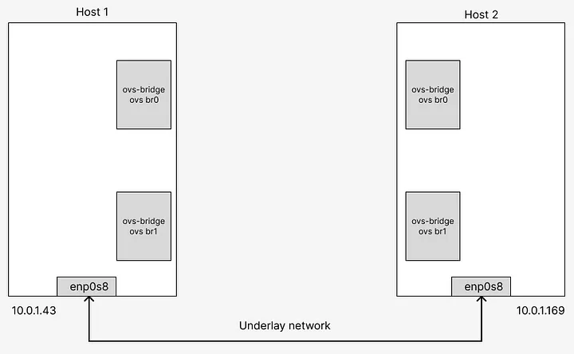

Then create the internal port/interfaces to the ovs-bridge:

For Host 1:

```ruby
# For VM1
# add port/interfaces to bridges
sudo ovs-vsctl add-port ovs-br0 veth0 -- set interface veth0 type=internal
sudo ovs-vsctl add-port ovs-br1 veth1 -- set interface veth1 type=internal
# ovs-br0 is the bridge name
# veth0 is the interface/port name where type is 'internal'

# check the status of bridges
sudo ovs-vsctl show

# gitbash output
28385bfb-80fc-4664-bce6-2895fb016cdd
    Bridge "ovs-br0"
        Port "veth0"
            Interface "veth0"
                type: internal
        Port "ovs-br0"
            Interface "ovs-br0"
                type: internal
    Bridge "ovs-br1"
        Port "veth1"
            Interface "veth1"
                type: internal
        Port "ovs-br1"
            Interface "ovs-br1"
                type: internal
    ovs_version: "2.9.8"
```

For Host 2:

```ruby
# For VM2
# add port/interfaces to bridges
sudo ovs-vsctl add-port ovs-br0 veth0 -- set interface veth0 type=internal
sudo ovs-vsctl add-port ovs-br1 veth1 -- set interface veth1 type=internal
# ovs-br0 is the bridge name
# veth0 is the interface/port name where type is 'internal'

# check the status of bridges
sudo ovs-vsctl show

# gitbash output
ce05eb34-56d4-4bc4-a1e7-8ed2f4aa7bfc
    Bridge "ovs-br1"
        Port "veth1"
            Interface "veth1"
                type: internal
        Port "ovs-br1"
            Interface "ovs-br1"
                type: internal
    Bridge "ovs-br0"
        Port "veth0"
            Interface "veth0"
                type: internal
        Port "ovs-br0"
            Interface "ovs-br0"
                type: internal
    ovs_version: "2.9.8"
```

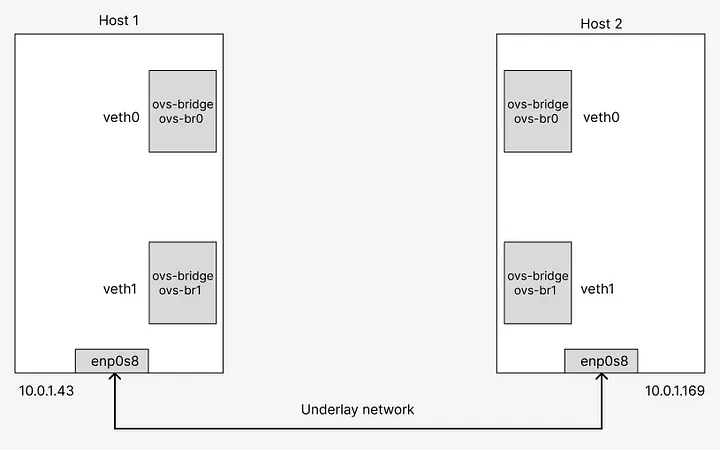

Now it’s time to set the IP of the bridges and up the inteface:

For Host 1:

```ruby
# For VM1

# set the ip to the created port/interfaces
sudo ip address add 192.168.1.1/24 dev veth0 
sudo ip address add 192.168.2.1/24 dev veth1

# Check the status, link should be down
ip a

# gitbash output(This is output from gitbash after ip a command)
1: lo: <LOOPBACK,UP,LOWER_UP> mtu 65536 qdisc noqueue state UNKNOWN group default qlen 1000
    link/loopback 00:00:00:00:00:00 brd 00:00:00:00:00:00
    inet 127.0.0.1/8 scope host lo
       valid_lft forever preferred_lft forever
    inet6 ::1/128 scope host
       valid_lft forever preferred_lft forever
2: enp0s3: <BROADCAST,MULTICAST,UP,LOWER_UP> mtu 1500 qdisc fq_codel state UP group default qlen 1000
    link/ether 02:3b:7b:b7:3b:2d brd ff:ff:ff:ff:ff:ff
    inet 10.0.2.15/24 brd 10.0.2.255 scope global dynamic enp0s3
       valid_lft 84299sec preferred_lft 84299sec
    inet6 fe80::3b:7bff:feb7:3b2d/64 scope link
       valid_lft forever preferred_lft forever
3: enp0s8: <BROADCAST,MULTICAST,UP,LOWER_UP> mtu 1500 qdisc fq_codel state UP group default qlen 1000
    link/ether 08:00:27:b5:f2:04 brd ff:ff:ff:ff:ff:ff
    inet 10.0.1.43/24 brd 10.0.1.255 scope global enp0s8
       valid_lft forever preferred_lft forever
    inet6 fe80::a00:27ff:feb5:f204/64 scope link
       valid_lft forever preferred_lft forever
4: docker0: <NO-CARRIER,BROADCAST,MULTICAST,UP> mtu 1500 qdisc noqueue state DOWN group default
    link/ether 02:42:45:74:a4:d5 brd ff:ff:ff:ff:ff:ff
    inet 172.17.0.1/16 brd 172.17.255.255 scope global docker0
       valid_lft forever preferred_lft forever
5: ovs-system: <BROADCAST,MULTICAST> mtu 1500 qdisc noop state DOWN group default qlen 1000
    link/ether 46:18:65:10:76:5d brd ff:ff:ff:ff:ff:ff
6: ovs-br0: <BROADCAST,MULTICAST> mtu 1500 qdisc noop state DOWN group default qlen 1000
    link/ether ae:77:93:3b:e5:47 brd ff:ff:ff:ff:ff:ff
7: ovs-br1: <BROADCAST,MULTICAST> mtu 1500 qdisc noop state DOWN group default qlen 1000
    link/ether 86:61:26:a3:11:42 brd ff:ff:ff:ff:ff:ff
8: veth0: <BROADCAST,MULTICAST> mtu 1500 qdisc noop state DOWN group default qlen 1000
    link/ether 76:42:7d:c8:2b:7f brd ff:ff:ff:ff:ff:ff
    inet 192.168.1.1/24 scope global veth0
       valid_lft forever preferred_lft forever
9: veth1: <BROADCAST,MULTICAST> mtu 1500 qdisc noop state DOWN group default qlen 1000
    link/ether 12:07:38:70:3e:5f brd ff:ff:ff:ff:ff:ff
    inet 192.168.2.1/24 scope global veth1
       valid_lft forever preferred_lft forever


# up the interfaces and check status
sudo ip link set dev veth0 up mtu 1450
sudo ip link set dev veth1 up mtu 1450

# Check the status, link should be UP/UNKNOWN 
ip a

# gitbash output
1: lo: <LOOPBACK,UP,LOWER_UP> mtu 65536 qdisc noqueue state UNKNOWN group default qlen 1000
    link/loopback 00:00:00:00:00:00 brd 00:00:00:00:00:00
    inet 127.0.0.1/8 scope host lo
       valid_lft forever preferred_lft forever
    inet6 ::1/128 scope host
       valid_lft forever preferred_lft forever
2: enp0s3: <BROADCAST,MULTICAST,UP,LOWER_UP> mtu 1500 qdisc fq_codel state UP group default qlen 1000
    link/ether 02:3b:7b:b7:3b:2d brd ff:ff:ff:ff:ff:ff
    inet 10.0.2.15/24 brd 10.0.2.255 scope global dynamic enp0s3
       valid_lft 84141sec preferred_lft 84141sec
    inet6 fe80::3b:7bff:feb7:3b2d/64 scope link
       valid_lft forever preferred_lft forever
3: enp0s8: <BROADCAST,MULTICAST,UP,LOWER_UP> mtu 1500 qdisc fq_codel state UP group default qlen 1000
    link/ether 08:00:27:b5:f2:04 brd ff:ff:ff:ff:ff:ff
    inet 10.0.1.43/24 brd 10.0.1.255 scope global enp0s8
       valid_lft forever preferred_lft forever
    inet6 fe80::a00:27ff:feb5:f204/64 scope link
       valid_lft forever preferred_lft forever
4: docker0: <NO-CARRIER,BROADCAST,MULTICAST,UP> mtu 1500 qdisc noqueue state DOWN group default
    link/ether 02:42:45:74:a4:d5 brd ff:ff:ff:ff:ff:ff
    inet 172.17.0.1/16 brd 172.17.255.255 scope global docker0
       valid_lft forever preferred_lft forever
5: ovs-system: <BROADCAST,MULTICAST> mtu 1500 qdisc noop state DOWN group default qlen 1000
    link/ether 46:18:65:10:76:5d brd ff:ff:ff:ff:ff:ff
6: ovs-br0: <BROADCAST,MULTICAST> mtu 1500 qdisc noop state DOWN group default qlen 1000
    link/ether ae:77:93:3b:e5:47 brd ff:ff:ff:ff:ff:ff
7: ovs-br1: <BROADCAST,MULTICAST> mtu 1500 qdisc noop state DOWN group default qlen 1000
    link/ether 86:61:26:a3:11:42 brd ff:ff:ff:ff:ff:ff
8: veth0: <BROADCAST,MULTICAST,UP,LOWER_UP> mtu 1450 qdisc noqueue state UNKNOWN group default qlen 1000
    link/ether 76:42:7d:c8:2b:7f brd ff:ff:ff:ff:ff:ff
    inet 192.168.1.1/24 scope global veth0
       valid_lft forever preferred_lft forever
    inet6 fe80::7442:7dff:fec8:2b7f/64 scope link
       valid_lft forever preferred_lft forever
9: veth1: <BROADCAST,MULTICAST,UP,LOWER_UP> mtu 1450 qdisc noqueue state UNKNOWN group default qlen 1000
    link/ether 12:07:38:70:3e:5f brd ff:ff:ff:ff:ff:ff
    inet 192.168.2.1/24 scope global veth1
       valid_lft forever preferred_lft forever
    inet6 fe80::1007:38ff:fe70:3e5f/64 scope link
       valid_lft forever preferred_lft forever
```

For Host 2:

```ruby
# For VM2

# set the ip to the created port/interfaces
sudo ip address add 192.168.1.1/24 dev veth0 
sudo ip address add 192.168.2.1/24 dev veth1

# Check the status, link should be down
ip a

# gitbash output(This is output from gitbash after ip a command)
1: lo: <LOOPBACK,UP,LOWER_UP> mtu 65536 qdisc noqueue state UNKNOWN group default qlen 1000
    link/loopback 00:00:00:00:00:00 brd 00:00:00:00:00:00
    inet 127.0.0.1/8 scope host lo
       valid_lft forever preferred_lft forever
    inet6 ::1/128 scope host
       valid_lft forever preferred_lft forever
2: enp0s3: <BROADCAST,MULTICAST,UP,LOWER_UP> mtu 1500 qdisc fq_codel state UP group default qlen 1000
    link/ether 02:3b:7b:b7:3b:2d brd ff:ff:ff:ff:ff:ff
    inet 10.0.2.15/24 brd 10.0.2.255 scope global dynamic enp0s3
       valid_lft 84474sec preferred_lft 84474sec
    inet6 fe80::3b:7bff:feb7:3b2d/64 scope link
       valid_lft forever preferred_lft forever
3: enp0s8: <BROADCAST,MULTICAST,UP,LOWER_UP> mtu 1500 qdisc fq_codel state UP group default qlen 1000
    link/ether 08:00:27:18:a7:a3 brd ff:ff:ff:ff:ff:ff
    inet 10.0.1.169/24 brd 10.0.1.255 scope global enp0s8
       valid_lft forever preferred_lft forever
    inet6 fe80::a00:27ff:fe18:a7a3/64 scope link
       valid_lft forever preferred_lft forever
4: docker0: <NO-CARRIER,BROADCAST,MULTICAST,UP> mtu 1500 qdisc noqueue state DOWN group default
    link/ether 02:42:65:9d:41:76 brd ff:ff:ff:ff:ff:ff
    inet 172.17.0.1/16 brd 172.17.255.255 scope global docker0
       valid_lft forever preferred_lft forever
5: ovs-system: <BROADCAST,MULTICAST> mtu 1500 qdisc noop state DOWN group default qlen 1000
    link/ether 5a:c9:43:9e:6a:c3 brd ff:ff:ff:ff:ff:ff
6: ovs-br0: <BROADCAST,MULTICAST> mtu 1500 qdisc noop state DOWN group default qlen 1000
    link/ether 52:60:70:e8:91:4f brd ff:ff:ff:ff:ff:ff
7: ovs-br1: <BROADCAST,MULTICAST> mtu 1500 qdisc noop state DOWN group default qlen 1000
    link/ether ba:a7:03:39:cb:4b brd ff:ff:ff:ff:ff:ff
8: veth0: <BROADCAST,MULTICAST> mtu 1500 qdisc noop state DOWN group default qlen 1000
    link/ether aa:27:3b:f5:63:8a brd ff:ff:ff:ff:ff:ff
    inet 192.168.1.1/24 scope global veth0
       valid_lft forever preferred_lft forever
9: veth1: <BROADCAST,MULTICAST> mtu 1500 qdisc noop state DOWN group default qlen 1000
    link/ether 96:9c:27:a6:83:ad brd ff:ff:ff:ff:ff:ff
    inet 192.168.2.1/24 scope global veth1
       valid_lft forever preferred_lft forever

# up the interfaces and check status
sudo ip link set dev veth0 up mtu 1450
sudo ip link set dev veth1 up mtu 1450

# Check the status, link should be UP/UNKNOWN 
ip a

# gitbash output
1: lo: <LOOPBACK,UP,LOWER_UP> mtu 65536 qdisc noqueue state UNKNOWN group default qlen 1000
    link/loopback 00:00:00:00:00:00 brd 00:00:00:00:00:00
    inet 127.0.0.1/8 scope host lo
       valid_lft forever preferred_lft forever
    inet6 ::1/128 scope host
       valid_lft forever preferred_lft forever
2: enp0s3: <BROADCAST,MULTICAST,UP,LOWER_UP> mtu 1500 qdisc fq_codel state UP group default qlen 1000
    link/ether 02:3b:7b:b7:3b:2d brd ff:ff:ff:ff:ff:ff
    inet 10.0.2.15/24 brd 10.0.2.255 scope global dynamic enp0s3
       valid_lft 84425sec preferred_lft 84425sec
    inet6 fe80::3b:7bff:feb7:3b2d/64 scope link
       valid_lft forever preferred_lft forever
3: enp0s8: <BROADCAST,MULTICAST,UP,LOWER_UP> mtu 1500 qdisc fq_codel state UP group default qlen 1000
    link/ether 08:00:27:18:a7:a3 brd ff:ff:ff:ff:ff:ff
    inet 10.0.1.169/24 brd 10.0.1.255 scope global enp0s8
       valid_lft forever preferred_lft forever
    inet6 fe80::a00:27ff:fe18:a7a3/64 scope link
       valid_lft forever preferred_lft forever
4: docker0: <NO-CARRIER,BROADCAST,MULTICAST,UP> mtu 1500 qdisc noqueue state DOWN group default
    link/ether 02:42:65:9d:41:76 brd ff:ff:ff:ff:ff:ff
    inet 172.17.0.1/16 brd 172.17.255.255 scope global docker0
       valid_lft forever preferred_lft forever
5: ovs-system: <BROADCAST,MULTICAST> mtu 1500 qdisc noop state DOWN group default qlen 1000
    link/ether 5a:c9:43:9e:6a:c3 brd ff:ff:ff:ff:ff:ff
6: ovs-br0: <BROADCAST,MULTICAST> mtu 1500 qdisc noop state DOWN group default qlen 1000
    link/ether 52:60:70:e8:91:4f brd ff:ff:ff:ff:ff:ff
7: ovs-br1: <BROADCAST,MULTICAST> mtu 1500 qdisc noop state DOWN group default qlen 1000
    link/ether ba:a7:03:39:cb:4b brd ff:ff:ff:ff:ff:ff
8: veth0: <BROADCAST,MULTICAST,UP,LOWER_UP> mtu 1450 qdisc noqueue state UNKNOWN group default qlen 1000
    link/ether aa:27:3b:f5:63:8a brd ff:ff:ff:ff:ff:ff
    inet 192.168.1.1/24 scope global veth0
       valid_lft forever preferred_lft forever
    inet6 fe80::a827:3bff:fef5:638a/64 scope link
       valid_lft forever preferred_lft forever
9: veth1: <BROADCAST,MULTICAST,UP,LOWER_UP> mtu 1450 qdisc noqueue state UNKNOWN group default qlen 1000
    link/ether 96:9c:27:a6:83:ad brd ff:ff:ff:ff:ff:ff
    inet 192.168.2.1/24 scope global veth1
       valid_lft forever preferred_lft forever
    inet6 fe80::949c:27ff:fea6:83ad/64 scope link
       valid_lft forever preferred_lft forever
```

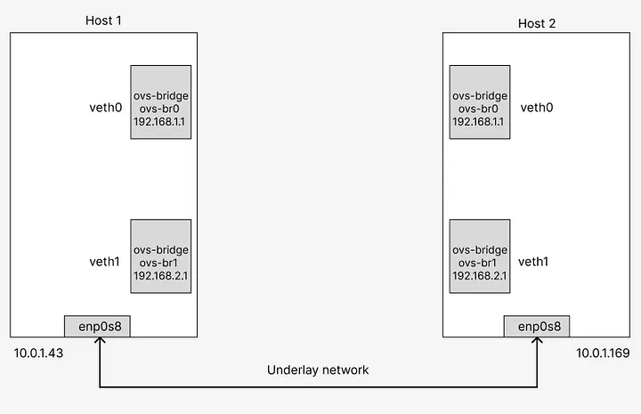


## Step 4: Creating DockerFile:

In this step we will create a docker file. To create docker file we will need vim or vi editor. If you don’t have vim editor, first please install vim editor in both host 1 and host 2.

```ruby
sudo apt install vim
```

Now type this command

For Host 1 and Host 2:

```ruby
vim Dockerfile
```

This command will create a Dockerfile under root folder. Now press i. If you press i , it should be in insert mode. Now copy and paste this commands for both host 1 and host 2 docker file.

```ruby
FROM ubuntu

RUN apt update
RUN apt install -y net-tools
RUN apt install -y iproute2
RUN apt install -y iputils-ping

CMD ["sleep", "7200"]
```

Now press Esc from keyboard. Insert mode will be gone. Now press this(:wq). Here w=save/write and q=quit. We are just saving this file and quit.

Now type ll(double L) in the gitbash. You will found this output.

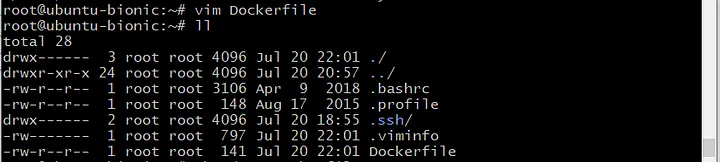

See? The Dockerfile we have created is showing here. But carefully look up the permission mode.(-rw-r — r — ). So, it’s not in executable mode. We need to make it executable.So, type this command

```ruby
chmod +x Dockerfile
```

Now, again type ll(double L) in gitbash. Now, see the figure, you will see that necessary permission is given and the file turn’s it’s color into green, which means it’s executable now.

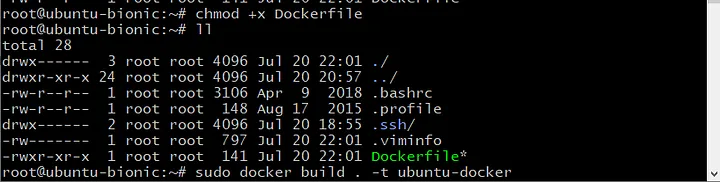

Now do this for both host 1 and host 2.

## Step 5: Set Docker Container:

It’s time to set docker container with None network. Also as container will not get any internet connection for now, we will need some tools to analysis so I already had writen a Dockerfile for this in step 4. Build the image first then run the container.

For Host 1:

```ruby
# For VM1
# create a docker image from the docker file 
# find the Dockerfile in step-4
sudo docker build . -t ubuntu-docker

# create containers from the created image; Containers not connected to any network
# docker 1
sudo docker run -d --net=none --name docker1 ubuntu-docker

# gitbash output
600322d32a930f16b100f6be0986a0514d5dabe77d73fdfef255127e5dd30214

# docker 2
sudo docker run -d --net=none --name docker2 ubuntu-docker

# gitbash output
b49774b22f004de2365b52ac9c7e310c2f55904d9f411aa96d941d0d09dd98bb

# check container status
sudo docker ps

# gitbash output
CONTAINER ID   IMAGE           COMMAND        CREATED              STATUS              PORTS     NAMES
b49774b22f00   ubuntu-docker   "sleep 7200"   About a minute ago   Up About a minute             docker2
600322d32a93   ubuntu-docker   "sleep 7200"   3 minutes ago        Up 3 minutes                  docker1

# check container ip
# docker 1 ip
sudo docker exec docker1 ip a

# gitbash output
1: lo: <LOOPBACK,UP,LOWER_UP> mtu 65536 qdisc noqueue state UNKNOWN group default qlen 1000
    link/loopback 00:00:00:00:00:00 brd 00:00:00:00:00:00
    inet 127.0.0.1/8 scope host lo
       valid_lft forever preferred_lft forever

# docker 2 ip
sudo docker exec docker2 ip a

# gitbash output
1: lo: <LOOPBACK,UP,LOWER_UP> mtu 65536 qdisc noqueue state UNKNOWN group default qlen 1000
    link/loopback 00:00:00:00:00:00 brd 00:00:00:00:00:00
    inet 127.0.0.1/8 scope host lo
       valid_lft forever preferred_lft forever
```

For Host 2:

```ruby
# For VM2
# create a docker image from the docker file 
# find the Dockerfile in step-4
sudo docker build . -t ubuntu-docker

# create containers from the created image; Containers not connected to any network
# docker 3
sudo docker run -d --net=none --name docker3 ubuntu-docker

# gitbash output
2d4b2994a9f5a147c5e8555b6a68ddf3a23e06568a8cb1be11b67ed4b9f1403e

# docker 4
sudo docker run -d --net=none --name docker4 ubuntu-docker

# gitbash output
f1b1090cfb26ccb5ed959a41f647499e9f553d4e292dc5f8d0f943e22bd753a0

# check container status
sudo docker ps

# gitbash output
CONTAINER ID   IMAGE           COMMAND        CREATED          STATUS          PORTS     NAMES
f1b1090cfb26   ubuntu-docker   "sleep 7200"   23 seconds ago   Up 21 seconds             docker4
2d4b2994a9f5   ubuntu-docker   "sleep 7200"   50 seconds ago   Up 48 seconds             docker3

# check container ip
# docker 3 ip
sudo docker exec docker3 ip a

# gitbash output
1: lo: <LOOPBACK,UP,LOWER_UP> mtu 65536 qdisc noqueue state UNKNOWN group default qlen 1000
    link/loopback 00:00:00:00:00:00 brd 00:00:00:00:00:00
    inet 127.0.0.1/8 scope host lo
       valid_lft forever preferred_lft forever

# docker 4 ip
sudo docker exec docker4 ip a

# gitbash output
1: lo: <LOOPBACK,UP,LOWER_UP> mtu 65536 qdisc noqueue state UNKNOWN group default qlen 1000
    link/loopback 00:00:00:00:00:00 brd 00:00:00:00:00:00
    inet 127.0.0.1/8 scope host lo
       valid_lft forever preferred_lft forever
```

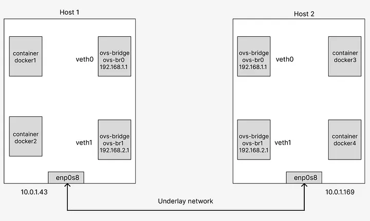

Now assign the static IP address to the containers using ovs-docker utility. also ping the GW to test the connectivity.

For Host 1:

```ruby
# For VM1
# add ip address to the container using ovs-docker utility 
# docker 1 ip setting
sudo ovs-docker add-port ovs-br0 eth0 docker1 --ipaddress=192.168.1.11/24 --gateway=192.168.1.1
sudo docker exec docker1 ip a

# gitbash output
1: lo: <LOOPBACK,UP,LOWER_UP> mtu 65536 qdisc noqueue state UNKNOWN group default qlen 1000
    link/loopback 00:00:00:00:00:00 brd 00:00:00:00:00:00
    inet 127.0.0.1/8 scope host lo
       valid_lft forever preferred_lft forever
18: eth0@if19: <BROADCAST,MULTICAST,UP,LOWER_UP> mtu 1500 qdisc noqueue state UP group default qlen 1000
    link/ether 82:66:c5:fe:39:e9 brd ff:ff:ff:ff:ff:ff link-netnsid 0
    inet 192.168.1.11/24 scope global eth0
       valid_lft forever preferred_lft forever

# docker 2 ip setting
sudo ovs-docker add-port ovs-br1 eth0 docker2 --ipaddress=192.168.2.11/24 --gateway=192.168.2.1
sudo docker exec docker2 ip a

# gitbash output
1: lo: <LOOPBACK,UP,LOWER_UP> mtu 65536 qdisc noqueue state UNKNOWN group default qlen 1000
    link/loopback 00:00:00:00:00:00 brd 00:00:00:00:00:00
    inet 127.0.0.1/8 scope host lo
       valid_lft forever preferred_lft forever
20: eth0@if21: <BROADCAST,MULTICAST,UP,LOWER_UP> mtu 1500 qdisc noqueue state UP group default qlen 1000
    link/ether 1a:1c:81:76:d1:ee brd ff:ff:ff:ff:ff:ff link-netnsid 0
    inet 192.168.2.11/24 scope global eth0
       valid_lft forever preferred_lft forever

# ping the gateway to check if container connected to ovs-bridges
# docker 1
sudo docker exec docker1 ping 192.168.1.1 -c 5

# gitbash output
PING 192.168.1.1 (192.168.1.1) 56(84) bytes of data.
64 bytes from 192.168.1.1: icmp_seq=1 ttl=64 time=0.166 ms
64 bytes from 192.168.1.1: icmp_seq=2 ttl=64 time=0.144 ms
64 bytes from 192.168.1.1: icmp_seq=3 ttl=64 time=0.141 ms
64 bytes from 192.168.1.1: icmp_seq=4 ttl=64 time=0.164 ms
64 bytes from 192.168.1.1: icmp_seq=5 ttl=64 time=0.141 ms

--- 192.168.1.1 ping statistics ---
5 packets transmitted, 5 received, 0% packet loss, time 4084ms
rtt min/avg/max/mdev = 0.141/0.151/0.166/0.011 ms

# docker 2
sudo docker exec docker2 ping 192.168.2.1 -c 5

# gitbash output
PING 192.168.2.1 (192.168.2.1) 56(84) bytes of data.
64 bytes from 192.168.2.1: icmp_seq=1 ttl=64 time=1.07 ms
64 bytes from 192.168.2.1: icmp_seq=2 ttl=64 time=0.145 ms
64 bytes from 192.168.2.1: icmp_seq=3 ttl=64 time=0.110 ms
64 bytes from 192.168.2.1: icmp_seq=4 ttl=64 time=0.125 ms
64 bytes from 192.168.2.1: icmp_seq=5 ttl=64 time=0.126 ms

--- 192.168.2.1 ping statistics ---
5 packets transmitted, 5 received, 0% packet loss, time 4080ms
rtt min/avg/max/mdev = 0.110/0.316/1.074/0.379 ms
```

For Host 2:

```ruby
# For VM2
# add ip address to the container using ovs-docker utility 
# docker 3 ip setting
sudo ovs-docker add-port ovs-br0 eth0 docker3 --ipaddress=192.168.1.12/24 --gateway=192.168.1.1
sudo docker exec docker3 ip a

# gitbash output
1: lo: <LOOPBACK,UP,LOWER_UP> mtu 65536 qdisc noqueue state UNKNOWN group default qlen 1000
    link/loopback 00:00:00:00:00:00 brd 00:00:00:00:00:00
    inet 127.0.0.1/8 scope host lo
       valid_lft forever preferred_lft forever
18: eth0@if19: <BROADCAST,MULTICAST,UP,LOWER_UP> mtu 1500 qdisc noqueue state UP group default qlen 1000
    link/ether e6:96:06:35:35:58 brd ff:ff:ff:ff:ff:ff link-netnsid 0
    inet 192.168.1.12/24 scope global eth0
       valid_lft forever preferred_lft forever

# docker 4 ip setting
sudo ovs-docker add-port ovs-br1 eth0 docker4 --ipaddress=192.168.2.12/24 --gateway=192.168.2.1
sudo docker exec docker4 ip a

# gitbash output
1: lo: <LOOPBACK,UP,LOWER_UP> mtu 65536 qdisc noqueue state UNKNOWN group default qlen 1000
    link/loopback 00:00:00:00:00:00 brd 00:00:00:00:00:00
    inet 127.0.0.1/8 scope host lo
       valid_lft forever preferred_lft forever
20: eth0@if21: <BROADCAST,MULTICAST,UP,LOWER_UP> mtu 1500 qdisc noqueue state UP group default qlen 1000
    link/ether be:51:0b:0d:26:8b brd ff:ff:ff:ff:ff:ff link-netnsid 0
    inet 192.168.2.12/24 scope global eth0
       valid_lft forever preferred_lft forever

# ping the gateway to check if container connected to ovs-bridges
# docker 3
sudo docker exec docker3 ping 192.168.1.1 -c 5

# gitbash output
PING 192.168.1.1 (192.168.1.1) 56(84) bytes of data.
64 bytes from 192.168.1.1: icmp_seq=1 ttl=64 time=0.847 ms
64 bytes from 192.168.1.1: icmp_seq=2 ttl=64 time=0.118 ms
64 bytes from 192.168.1.1: icmp_seq=3 ttl=64 time=0.086 ms
64 bytes from 192.168.1.1: icmp_seq=4 ttl=64 time=0.127 ms
64 bytes from 192.168.1.1: icmp_seq=5 ttl=64 time=0.125 ms

--- 192.168.1.1 ping statistics ---
5 packets transmitted, 5 received, 0% packet loss, time 4069ms
rtt min/avg/max/mdev = 0.086/0.260/0.847/0.293 ms

# docker 4
sudo docker exec docker4 ping 192.168.2.1 -c 5

# gitbash output
PING 192.168.2.1 (192.168.2.1) 56(84) bytes of data.
64 bytes from 192.168.2.1: icmp_seq=1 ttl=64 time=0.956 ms
64 bytes from 192.168.2.1: icmp_seq=2 ttl=64 time=0.088 ms
64 bytes from 192.168.2.1: icmp_seq=3 ttl=64 time=0.388 ms
64 bytes from 192.168.2.1: icmp_seq=4 ttl=64 time=0.088 ms
64 bytes from 192.168.2.1: icmp_seq=5 ttl=64 time=0.130 ms

--- 192.168.2.1 ping statistics ---
5 packets transmitted, 5 received, 0% packet loss, time 4105ms
rtt min/avg/max/mdev = 0.088/0.330/0.956/0.332 ms
```

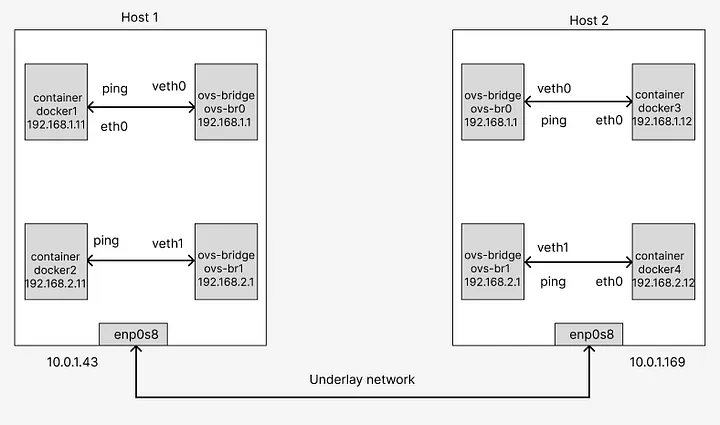


## Step 6: Establish VXLAN Tunneling:

Now we are going to establish the VXLAN Tunneling between the two VM. Most importantly the vxlan ID or VNI and udp port 4789 is important. Also we have to configure the remote IP which is opposite VM IP.

For Host 1:

```ruby
# For VM1
# one thing to check; as vxlan communicate using udp port 4789, check the current status
netstat -ntulp

# gitbash output
Active Internet connections (only servers)
Proto Recv-Q Send-Q Local Address           Foreign Address         State       PID/Program name
tcp        0      0 127.0.0.1:38995         0.0.0.0:*               LISTEN      1182/containerd
tcp        0      0 127.0.0.53:53           0.0.0.0:*               LISTEN      638/systemd-resolve
tcp        0      0 0.0.0.0:22              0.0.0.0:*               LISTEN      1492/sshd
tcp6       0      0 :::22                   :::*                    LISTEN      1492/sshd
udp        0      0 127.0.0.53:53           0.0.0.0:*                           638/systemd-resolve
udp        0      0 10.0.2.15:68            0.0.0.0:*                           2271/systemd-networ

# Create the vxlan tunnel using ovs vxlan feature for both bridges to another hosts bridges
# make sure remote IP and key options; they are important
sudo ovs-vsctl add-port ovs-br0 vxlan0 -- set interface vxlan0 type=vxlan options:remote_ip=10.0.1.169 options:key=1000
# key is VNI
# vxlan0 is the interface/port name
# type is vxlan which also configures udp port 4789 default
sudo ovs-vsctl add-port ovs-br1 vxlan1 -- set interface vxlan1 type=vxlan options:remote_ip=10.0.1.169 options:key=2000

# check the port again; it should be listening
netstat -ntulp | grep 4789

# gitbash output
udp        0      0 0.0.0.0:4789            0.0.0.0:*                           -
udp6       0      0 :::4789                 :::*  

# overall bridge showing
sudo ovs-vsctl show

# gitbash output
28385bfb-80fc-4664-bce6-2895fb016cdd
    Bridge "ovs-br0"
        Port "18a3256db1d64_l"
            Interface "18a3256db1d64_l"
        Port "veth0"
            Interface "veth0"
                type: internal
        Port "vxlan0"
            Interface "vxlan0"
                type: vxlan
                options: {key="1000", remote_ip="10.0.1.169"}
        Port "ovs-br0"
            Interface "ovs-br0"
                type: internal
    Bridge "ovs-br1"
        Port "veth1"
            Interface "veth1"
                type: internal
        Port "07375de8390b4_l"
            Interface "07375de8390b4_l"
        Port "vxlan1"
            Interface "vxlan1"
                type: vxlan
                options: {key="2000", remote_ip="10.0.1.169"}
        Port "ovs-br1"
            Interface "ovs-br1"
                type: internal
    ovs_version: "2.9.8"

# ip address showing
ip a

# gitbash output
1: lo: <LOOPBACK,UP,LOWER_UP> mtu 65536 qdisc noqueue state UNKNOWN group default qlen 1000
    link/loopback 00:00:00:00:00:00 brd 00:00:00:00:00:00
    inet 127.0.0.1/8 scope host lo
       valid_lft forever preferred_lft forever
    inet6 ::1/128 scope host
       valid_lft forever preferred_lft forever
2: enp0s3: <BROADCAST,MULTICAST,UP,LOWER_UP> mtu 1500 qdisc fq_codel state UP group default qlen 1000
    link/ether 02:3b:7b:b7:3b:2d brd ff:ff:ff:ff:ff:ff
    inet 10.0.2.15/24 brd 10.0.2.255 scope global dynamic enp0s3
       valid_lft 79221sec preferred_lft 79221sec
    inet6 fe80::3b:7bff:feb7:3b2d/64 scope link
       valid_lft forever preferred_lft forever
3: enp0s8: <BROADCAST,MULTICAST,UP,LOWER_UP> mtu 1500 qdisc fq_codel state UP group default qlen 1000
    link/ether 08:00:27:b5:f2:04 brd ff:ff:ff:ff:ff:ff
    inet 10.0.1.43/24 brd 10.0.1.255 scope global enp0s8
       valid_lft forever preferred_lft forever
    inet6 fe80::a00:27ff:feb5:f204/64 scope link
       valid_lft forever preferred_lft forever
4: docker0: <NO-CARRIER,BROADCAST,MULTICAST,UP> mtu 1500 qdisc noqueue state DOWN group default
    link/ether 02:42:45:74:a4:d5 brd ff:ff:ff:ff:ff:ff
    inet 172.17.0.1/16 brd 172.17.255.255 scope global docker0
       valid_lft forever preferred_lft forever
    inet6 fe80::42:45ff:fe74:a4d5/64 scope link
       valid_lft forever preferred_lft forever
5: ovs-system: <BROADCAST,MULTICAST> mtu 1500 qdisc noop state DOWN group default qlen 1000
    link/ether 46:18:65:10:76:5d brd ff:ff:ff:ff:ff:ff
6: ovs-br0: <BROADCAST,MULTICAST> mtu 1500 qdisc noop state DOWN group default qlen 1000
    link/ether ae:77:93:3b:e5:47 brd ff:ff:ff:ff:ff:ff
7: ovs-br1: <BROADCAST,MULTICAST> mtu 1500 qdisc noop state DOWN group default qlen 1000
    link/ether 86:61:26:a3:11:42 brd ff:ff:ff:ff:ff:ff
8: veth0: <BROADCAST,MULTICAST,UP,LOWER_UP> mtu 1500 qdisc noqueue state UNKNOWN group default qlen 1000
    link/ether 76:42:7d:c8:2b:7f brd ff:ff:ff:ff:ff:ff
    inet 192.168.1.1/24 scope global veth0
       valid_lft forever preferred_lft forever
    inet6 fe80::7442:7dff:fec8:2b7f/64 scope link
       valid_lft forever preferred_lft forever
9: veth1: <BROADCAST,MULTICAST,UP,LOWER_UP> mtu 1500 qdisc noqueue state UNKNOWN group default qlen 1000
    link/ether 12:07:38:70:3e:5f brd ff:ff:ff:ff:ff:ff
    inet 192.168.2.1/24 scope global veth1
       valid_lft forever preferred_lft forever
    inet6 fe80::1007:38ff:fe70:3e5f/64 scope link
       valid_lft forever preferred_lft forever
19: 18a3256db1d64_l@if18: <BROADCAST,MULTICAST,UP,LOWER_UP> mtu 1500 qdisc noqueue master ovs-system state UP group default qlen 1000
    link/ether 1e:e1:81:f5:1d:20 brd ff:ff:ff:ff:ff:ff link-netnsid 0
    inet6 fe80::1ce1:81ff:fef5:1d20/64 scope link
       valid_lft forever preferred_lft forever
21: 07375de8390b4_l@if20: <BROADCAST,MULTICAST,UP,LOWER_UP> mtu 1500 qdisc noqueue master ovs-system state UP group default qlen 1000
    link/ether 0e:a8:e6:62:3d:2d brd ff:ff:ff:ff:ff:ff link-netnsid 1
    inet6 fe80::ca8:e6ff:fe62:3d2d/64 scope link
       valid_lft forever preferred_lft forever
22: vxlan_sys_4789: <BROADCAST,MULTICAST,UP,LOWER_UP> mtu 65000 qdisc noqueue master ovs-system state UNKNOWN group default qlen 1000
    link/ether 8a:b9:4f:fa:00:8e brd ff:ff:ff:ff:ff:ff
    inet6 fe80::88b9:4fff:fefa:8e/64 scope link
       valid_lft forever preferred_lft forever
```

For Host 2:

```ruby
# For VM 2
# one thing to check; as vxlan communicate using udp port 4789, check the current status
netstat -ntulp

# gitbash output
Active Internet connections (only servers)
Proto Recv-Q Send-Q Local Address           Foreign Address         State       PID/Program name
tcp        0      0 127.0.0.1:45515         0.0.0.0:*               LISTEN      2875/containerd
tcp        0      0 127.0.0.53:53           0.0.0.0:*               LISTEN      653/systemd-resolve
tcp        0      0 0.0.0.0:22              0.0.0.0:*               LISTEN      1034/sshd
tcp6       0      0 :::22                   :::*                    LISTEN      1034/sshd
udp        0      0 127.0.0.53:53           0.0.0.0:*                           653/systemd-resolve
udp        0      0 10.0.2.15:68            0.0.0.0:*                           1743/systemd-networ                         2271/systemd-networ

# Create the vxlan tunnel using ovs vxlan feature for both bridges to another hosts bridges
# make sure remote IP and key options; they are important
# key is VNI
# vxlan0 is the interface/port name
# type is vxlan which also configures udp port 4789 default
sudo ovs-vsctl add-port ovs-br0 vxlan0 -- set interface vxlan0 type=vxlan options:remote_ip=10.0.1.43 options:key=1000
sudo ovs-vsctl add-port ovs-br1 vxlan1 -- set interface vxlan1 type=vxlan options:remote_ip=10.0.1.43 options:key=2000

# check the port again; it should be listening
netstat -ntulp | grep 4789

# gitbash output
udp        0      0 0.0.0.0:4789            0.0.0.0:*                           -
udp6       0      0 :::4789                 :::*  

# overall bridge showing
sudo ovs-vsctl show

# gitbash output
ce05eb34-56d4-4bc4-a1e7-8ed2f4aa7bfc
    Bridge "ovs-br1"
        Port "veth1"
            Interface "veth1"
                type: internal
        Port "100797ceaa814_l"
            Interface "100797ceaa814_l"
        Port "vxlan1"
            Interface "vxlan1"
                type: vxlan
                options: {key="2000", remote_ip="10.0.1.43"}
        Port "ovs-br1"
            Interface "ovs-br1"
                type: internal
    Bridge "ovs-br0"
        Port "veth0"
            Interface "veth0"
                type: internal
        Port "8610ce9c4fd74_l"
            Interface "8610ce9c4fd74_l"
        Port "ovs-br0"
            Interface "ovs-br0"
                type: internal
        Port "vxlan0"
            Interface "vxlan0"
                type: vxlan
                options: {key="1000", remote_ip="10.0.1.43"}
    ovs_version: "2.9.8"

# ip address showing
ip a

# gitbash output
1: lo: <LOOPBACK,UP,LOWER_UP> mtu 65536 qdisc noqueue state UNKNOWN group default qlen 1000
    link/loopback 00:00:00:00:00:00 brd 00:00:00:00:00:00
    inet 127.0.0.1/8 scope host lo
       valid_lft forever preferred_lft forever
    inet6 ::1/128 scope host
       valid_lft forever preferred_lft forever
2: enp0s3: <BROADCAST,MULTICAST,UP,LOWER_UP> mtu 1500 qdisc fq_codel state UP group default qlen 1000
    link/ether 02:3b:7b:b7:3b:2d brd ff:ff:ff:ff:ff:ff
    inet 10.0.2.15/24 brd 10.0.2.255 scope global dynamic enp0s3
       valid_lft 79309sec preferred_lft 79309sec
    inet6 fe80::3b:7bff:feb7:3b2d/64 scope link
       valid_lft forever preferred_lft forever
3: enp0s8: <BROADCAST,MULTICAST,UP,LOWER_UP> mtu 1500 qdisc fq_codel state UP group default qlen 1000
    link/ether 08:00:27:18:a7:a3 brd ff:ff:ff:ff:ff:ff
    inet 10.0.1.169/24 brd 10.0.1.255 scope global enp0s8
       valid_lft forever preferred_lft forever
    inet6 fe80::a00:27ff:fe18:a7a3/64 scope link
       valid_lft forever preferred_lft forever
4: docker0: <NO-CARRIER,BROADCAST,MULTICAST,UP> mtu 1500 qdisc noqueue state DOWN group default
    link/ether 02:42:65:9d:41:76 brd ff:ff:ff:ff:ff:ff
    inet 172.17.0.1/16 brd 172.17.255.255 scope global docker0
       valid_lft forever preferred_lft forever
    inet6 fe80::42:65ff:fe9d:4176/64 scope link
       valid_lft forever preferred_lft forever
5: ovs-system: <BROADCAST,MULTICAST> mtu 1500 qdisc noop state DOWN group default qlen 1000
    link/ether 5a:c9:43:9e:6a:c3 brd ff:ff:ff:ff:ff:ff
6: ovs-br0: <BROADCAST,MULTICAST> mtu 1500 qdisc noop state DOWN group default qlen 1000
    link/ether 52:60:70:e8:91:4f brd ff:ff:ff:ff:ff:ff
7: ovs-br1: <BROADCAST,MULTICAST> mtu 1500 qdisc noop state DOWN group default qlen 1000
    link/ether ba:a7:03:39:cb:4b brd ff:ff:ff:ff:ff:ff
8: veth0: <BROADCAST,MULTICAST,UP,LOWER_UP> mtu 1500 qdisc noqueue state UNKNOWN group default qlen 1000
    link/ether aa:27:3b:f5:63:8a brd ff:ff:ff:ff:ff:ff
    inet 192.168.1.1/24 scope global veth0
       valid_lft forever preferred_lft forever
    inet6 fe80::a827:3bff:fef5:638a/64 scope link
       valid_lft forever preferred_lft forever
9: veth1: <BROADCAST,MULTICAST,UP,LOWER_UP> mtu 1500 qdisc noqueue state UNKNOWN group default qlen 1000
    link/ether 96:9c:27:a6:83:ad brd ff:ff:ff:ff:ff:ff
    inet 192.168.2.1/24 scope global veth1
       valid_lft forever preferred_lft forever
    inet6 fe80::949c:27ff:fea6:83ad/64 scope link
       valid_lft forever preferred_lft forever
19: 8610ce9c4fd74_l@if18: <BROADCAST,MULTICAST,UP,LOWER_UP> mtu 1500 qdisc noqueue master ovs-system state UP group default qlen 1000
    link/ether 3a:1e:a3:6d:84:1b brd ff:ff:ff:ff:ff:ff link-netnsid 0
    inet6 fe80::381e:a3ff:fe6d:841b/64 scope link
       valid_lft forever preferred_lft forever
21: 100797ceaa814_l@if20: <BROADCAST,MULTICAST,UP,LOWER_UP> mtu 1500 qdisc noqueue master ovs-system state UP group default qlen 1000
    link/ether 42:ee:ef:2f:9f:62 brd ff:ff:ff:ff:ff:ff link-netnsid 1
    inet6 fe80::40ee:efff:fe2f:9f62/64 scope link
       valid_lft forever preferred_lft forever
22: vxlan_sys_4789: <BROADCAST,MULTICAST,UP,LOWER_UP> mtu 65000 qdisc noqueue master ovs-system state UNKNOWN group default qlen 1000
    link/ether ca:d2:98:ea:ef:84 brd ff:ff:ff:ff:ff:ff
    inet6 fe80::c8d2:98ff:feea:ef84/64 scope link
       valid_lft forever preferred_lft forever
```


Now test the connectivity and see the magic!

```ruby
# FROM docker1
# will get ping
# ping from docker1 to docker3
sudo docker exec docker1 ping 192.168.1.12 -c 5

#gitbash output
PING 192.168.1.12 (192.168.1.12) 56(84) bytes of data.
64 bytes from 192.168.1.12: icmp_seq=1 ttl=64 time=4.10 ms
64 bytes from 192.168.1.12: icmp_seq=2 ttl=64 time=1.57 ms
64 bytes from 192.168.1.12: icmp_seq=3 ttl=64 time=1.66 ms
64 bytes from 192.168.1.12: icmp_seq=4 ttl=64 time=0.967 ms
64 bytes from 192.168.1.12: icmp_seq=5 ttl=64 time=1.68 ms

--- 192.168.1.12 ping statistics ---
5 packets transmitted, 5 received, 0% packet loss, time 4017ms
rtt min/avg/max/mdev = 0.967/1.995/4.102/1.085 ms

# ping from docker1 to docker1(self ping)
sudo docker exec docker1 ping 192.168.1.11 -c 5

# gitbash output
PING 192.168.1.11 (192.168.1.11) 56(84) bytes of data.
64 bytes from 192.168.1.11: icmp_seq=1 ttl=64 time=0.037 ms
64 bytes from 192.168.1.11: icmp_seq=2 ttl=64 time=0.097 ms
64 bytes from 192.168.1.11: icmp_seq=3 ttl=64 time=0.083 ms
64 bytes from 192.168.1.11: icmp_seq=4 ttl=64 time=0.091 ms
64 bytes from 192.168.1.11: icmp_seq=5 ttl=64 time=0.216 ms

--- 192.168.1.11 ping statistics ---
5 packets transmitted, 5 received, 0% packet loss, time 4094ms
rtt min/avg/max/mdev = 0.037/0.104/0.216/0.059 ms

# will be failed
# ping from docker1 to docker2
sudo docker exec docker1 ping 192.168.2.11 -c 5

# gitbash output
PING 192.168.2.11 (192.168.2.11) 56(84) bytes of data.

--- 192.168.2.11 ping statistics ---
5 packets transmitted, 0 received, 100% packet loss, time 4149ms

# ping from docker1 to docker4
sudo docker exec docker1 ping 192.168.2.12 -c 5

# gitbash output
PING 192.168.2.12 (192.168.2.12) 56(84) bytes of data.

--- 192.168.2.12 ping statistics ---
5 packets transmitted, 0 received, 100% packet loss, time 4185ms


# FROM docker2
# will get ping 
# ping from docker2 to docker2(self ping)
sudo docker exec docker2 ping 192.168.2.11 -c 2

# gitbash output
PING 192.168.2.11 (192.168.2.11) 56(84) bytes of data.
64 bytes from 192.168.2.11: icmp_seq=1 ttl=64 time=0.038 ms
64 bytes from 192.168.2.11: icmp_seq=2 ttl=64 time=0.081 ms

--- 192.168.2.11 ping statistics ---
2 packets transmitted, 2 received, 0% packet loss, time 1017ms
rtt min/avg/max/mdev = 0.038/0.059/0.081/0.021 ms

# ping from docker2 to docker4
sudo docker exec docker2 ping 192.168.2.12 -c 2

# gitbash output
PING 192.168.2.12 (192.168.2.12) 56(84) bytes of data.
64 bytes from 192.168.2.12: icmp_seq=1 ttl=64 time=4.97 ms
64 bytes from 192.168.2.12: icmp_seq=2 ttl=64 time=1.93 ms

--- 192.168.2.12 ping statistics ---
2 packets transmitted, 2 received, 0% packet loss, time 1001ms
rtt min/avg/max/mdev = 1.932/3.451/4.971/1.519 ms

# will be failed
# ping from docker2 to docker1
sudo docker exec docker2 ping 192.168.1.11 -c 2

# gitbash output
PING 192.168.1.11 (192.168.1.11) 56(84) bytes of data.

--- 192.168.1.11 ping statistics ---
2 packets transmitted, 0 received, 100% packet loss, time 1009ms

# ping from docker2 to docker3
sudo docker exec docker2 ping 192.168.1.12 -c 2

# gitbash output
PING 192.168.1.12 (192.168.1.12) 56(84) bytes of data.

--- 192.168.1.12 ping statistics ---
2 packets transmitted, 0 received, 100% packet loss, time 1014ms
```

The VXLAN tunneling is working. We can reach the other host’s docker conatiner with same VNI

Please look up the output figure of ping command

- ping from docker1 to docker3
  
  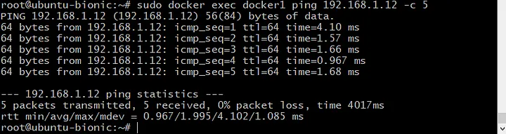
  
- ping from docker1 to docker1(self)
  
  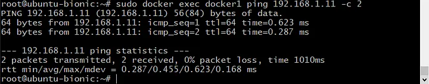
  
- ping from docker1 to docker2
  
  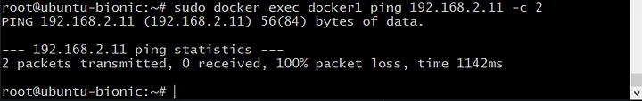
  
- ping from docker1 to docker4
  
  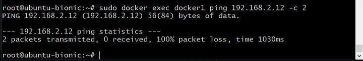
  
- ping from docker2 to docker2(self)
  
  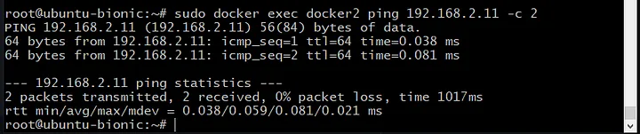
  
- ping from docker2 to docker4
  
  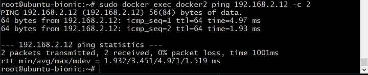
  
- ping from docker2 to docker1
  
   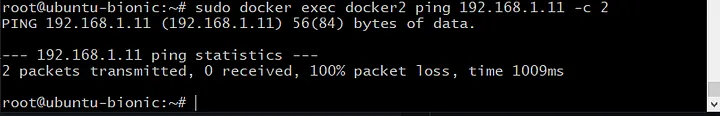
  
- ping from docker2 to docker3
  
  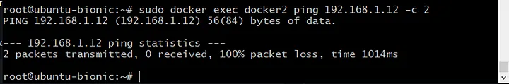
  

So, this is the end of the tutorial. I hope you enjoyed this hands on demo.
